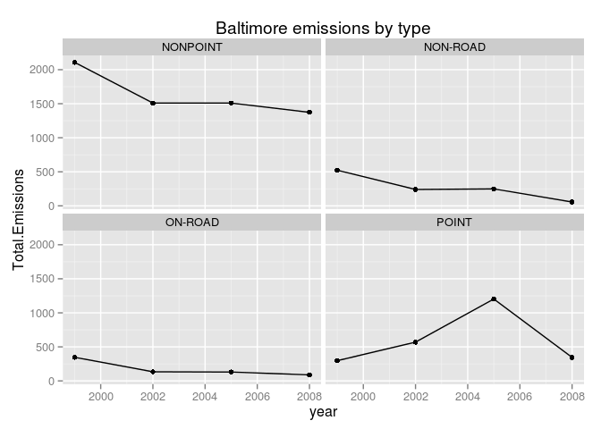
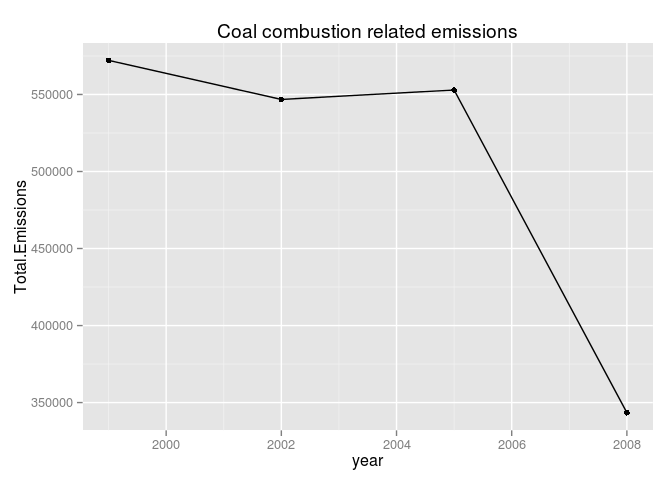
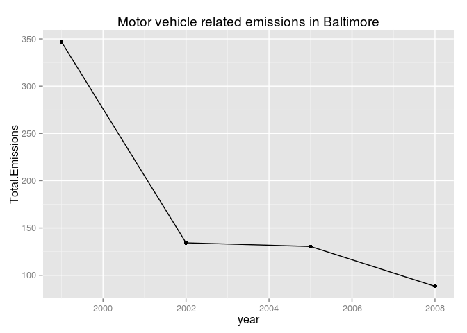
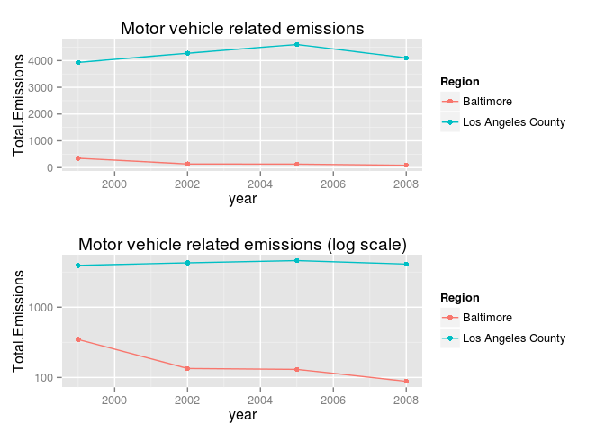

# Peer assessment 2
Aurimas R.  
11/19/2014  

#Assignment

Fine particulate matter (PM2.5) is an ambient air pollutant for which there is strong evidence that it is harmful to human health. In the United States, the Environmental Protection Agency (EPA) is tasked with setting national ambient air quality standards for fine PM and for tracking the emissions of this pollutant into the atmosphere. Approximatly every 3 years, the EPA releases its database on emissions of PM2.5. This database is known as the National Emissions Inventory (NEI). You can read more information about the NEI at the EPA National Emissions Inventory web site.

For each year and for each type of PM source, the NEI records how many tons of PM2.5 were emitted from that source over the course of the entire year. The data that you will use for this assignment are for 1999, 2002, 2005, and 2008.

The overall goal of this assignment is to explore the National Emissions Inventory database and see what it say about fine particulate matter pollution in the United states over the 10-year period 1999–2008. You may use any R package you want to support your analysis.

##Questions

You must address the following questions and tasks in your exploratory analysis. For each question/task you will need to make a single plot. Unless specified, you can use any plotting system in R to make your plot.

1. Have total emissions from PM2.5 decreased in the United States from 1999 to 2008? Using the base plotting system, make a plot showing the total PM2.5 emission from all sources for each of the years 1999, 2002, 2005, and 2008.

2. Have total emissions from PM2.5 decreased in the Baltimore City, Maryland (fips == "24510") from 1999 to 2008? Use the base plotting system to make a plot answering this question.

3. Of the four types of sources indicated by the type (point, nonpoint, onroad, nonroad) variable, which of these four sources have seen decreases in emissions from 1999–2008 for Baltimore City? Which have seen increases in emissions from 1999–2008? Use the ggplot2 plotting system to make a plot answer this question.

4. Across the United States, how have emissions from coal combustion-related sources changed from 1999–2008?

5. How have emissions from motor vehicle sources changed from 1999–2008 in Baltimore City?

6. Compare emissions from motor vehicle sources in Baltimore City with emissions from motor vehicle sources in Los Angeles County, California (fips == "06037"). Which city has seen greater changes over time in motor vehicle emissions?

##Answers

###Processing data


```r
library(data.table)
library(ggplot2)
library(gridExtra)
```

```
## Loading required package: grid
```

```r
library(scales)
unzip("exdata-data-NEI_data.zip")
NEI <- readRDS("summarySCC_PM25.rds")
SCC <- readRDS("Source_Classification_Code.rds")
NEID <- data.table(NEI)
```

###Answer 1


```r
d1 <- NEID[, sum(Emissions), by=year]
setnames(d1, "V1", "Total.Emissions")
plot(type="l", 
     x=d1$year, y=d1$Total.Emissions, 
     xlab="Years", ylab="Total Emissions", main="Total emissions in the U.S."
)
```

 

###Answer 2


```r
##filps 24510 is Baltimore
d2 <- NEID[fips=="24510"][, sum(Emissions), by=list(year)]
setnames(d2, "V1", "Total.Emissions")
plot(type="b", 
     x=d2$year, y=d2$Total.Emissions, 
     xlab="Years", ylab="Total Emissions", main="Total emissions in Baltimore"
)
```

 

###Answer 3


```r
##filps 24510 is Baltimore
d3 <- NEID[fips=="24510"][, sum(Emissions), by=list(year,type)]
setnames(d3, "V1", "Total.Emissions")
ggplot(data=d3, aes(x=year,y=Total.Emissions)) + geom_line() + geom_point() +
    facet_wrap(~type) +
    ggtitle('Baltimore emissions by type')
```

 

###Answer 4


```r
##Assumption is made that all Fuel Combustion sectors that mention Coal should capture all 
## coal-combustion sources. This is based on Table3 in http://www.epa.gov/ttn/chief/net/2008report.pdf
codes <- SCC$SCC[
    grepl("Fuel Comb", SCC$EI.Sector, fixed="TRUE") & 
    grepl("Coal", SCC$EI.Sector, fixed="TRUE")
]
d4 <- NEID[SCC %in% codes][, sum(Emissions), by=list(year)]
setnames(d4, "V1", "Total.Emissions")
ggplot(data=d4, aes(x=year,y=Total.Emissions)) + geom_line() + geom_point() +
    ggtitle('Coal combustion related emissions')
```

 

###Answer 5


```r
##Assumption is made that all Fuel Combustion sectors that mention Coal should capture all 
## coal-combustion sources. This is based on Table3 in http://www.epa.gov/ttn/chief/net/2008report.pdf
codes <- SCC$SCC[grepl("On-Road", SCC$EI.Sector, fixed="TRUE")]
d5 <- NEID[SCC %in% codes][fips=="24510"][, sum(Emissions), by=list(year)]
setnames(d5, "V1", "Total.Emissions")
ggplot(data=d5, aes(x=year,y=Total.Emissions)) + geom_line() + geom_point() +
    ggtitle('Motor vehicle related emissions in Baltimore')
```

 

###Answer 6


```r
##Assumption is made that all motor vehicles are on-road vehicles (as defined in Sector60 class.). 
##This is based on Table3 in http://www.epa.gov/ttn/chief/net/2008report.pdf
##filps 24510 is Baltimore, 06037 is Los Angeles County
codes <- SCC$SCC[grepl("On-Road", SCC$EI.Sector, fixed="TRUE")]
d6 <- NEID[SCC %in% codes][fips=="24510" | fips=="06037"][, sum(Emissions), by=list(year, fips)]
d6$fips <- sub("24510", "Baltimore", d6$fips)
d6$fips <- sub("06037", "Los Angeles County", d6$fips)
setnames(d6, "V1", "Total.Emissions")
setnames(d6, "fips", "Region")
p1 <- ggplot(data=d6, aes(x=year,y=Total.Emissions, colour=Region)) + geom_line(aes(group=Region)) + geom_point() +
    ggtitle('Motor vehicle related emissions')
p2 <- ggplot(data=d6, aes(x=year,y=Total.Emissions, colour=Region)) + geom_line(aes(group=Region)) + geom_point() +
    ggtitle('Motor vehicle related emissions (log scale)') + scale_y_continuous(trans=log10_trans())
grid.arrange(p1, p2, ncol=1)
```

 
